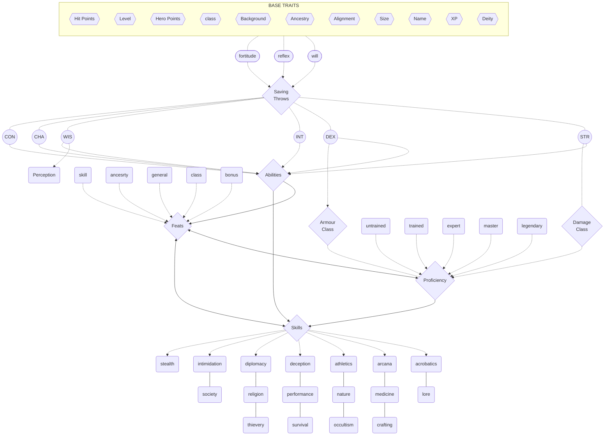

# Mermaid Test

```mermaid
flowchart TB
    %% NODES
    fortitude([fortitude])
    reflex([reflex])
    will([will])
   
    saves{Saving<br>Throws}
    
    feats{Feats}
    abilities{Abilities}
    skills{Skills}
    training{Proficiency}
    
    
    str((STR))
    dex((DEX))
    int((INT))
    wis((WIS))
    cha((CHA))
    con((CON))
    
    ac{Armour<br>Class}
    dc{Damage<br>Class}
    
    untrained(untrained)
    trained(trained)
    expert(expert)
    master(master)
    legendary(legendary)
    
    acrobatics(acrobatics)
    arcana(arcana)
    athletics(athletics)
    crafting(crafting)
    deception(deception)
    diplomacy(diplomacy)
    intimidation(intimidation)
    lore(lore)
    medicine(medicine)
    nature(nature)
    Occultism(occultism)
    performance(performance)
    religion(religion)
    society(society)
    stealth(stealth)
    survival(survival)
    thievery(thievery)
    
    skill_feat(skill)
    ancesrty_feat(ancesrty)
    general_feat(general)
    class_feat(class)
    bonus_feat(bonus)
    
    untrained-.->training
    trained-.->training
    expert-.->training
    master-.->training
    legendary-.->training
    
    perception(Perception)
    
    fortitude-.->saves
    reflex-.->saves
    will-.->saves
        
    subgraph bt [BASE TRAITS]
        direction TB
        hp{{Hit Points}} 
        level{{Level}}
        hero_points{{Hero Points}}
        cls{{class}}
        bkgrd{{Background}}
        ancestry{{Ancestry}}
        alignment{{Alignment}}
        size{{Size}}
        name{{Name}}
        xp{{XP}}
        deity{{Deity}}
    end
    
    bt-.-will
    bt-.-reflex
    bt-.-fortitude
    
    saves<-.-str
    saves<-.-dex
    saves<-.-int
    saves<-.-wis
    saves<-.-cha
    saves<-.-con
    
    wis-.->perception
        
    str-.->abilities
    dex-.->abilities
    int-.->abilities
    wis-.->abilities
    cha-.->abilities
    con-.->abilities
  
    str<-.-dc
    dc-.->training
 
    dex-.->ac
    ac<-.-training
      
    abilities-->feats
    training-->skills
    skills<-->feats
    abilities-->skills
    feats<-->training
    
    skill_feat-.->feats
    ancesrty_feat-.->feats
    general_feat-.->feats
    class_feat-.->feats
    bonus_feat-.->feats
    
    skills-.->acrobatics---lore
    skills-.->arcana---medicine---crafting
    skills-.->athletics---nature---Occultism 
    skills-.->deception---performance---survival
    skills-.->diplomacy---religion---thievery
    skills-.->intimidation---society
    skills-.->stealth
    
    %% subgraph ref [For Reference]
        %% a{Diamond}
        %% b((circle))
        %% c(curved)
        %% d([more-curved])
        %% e[rectangle]
        %% f[(database)]
        %% g>klaviyo]
        %% f{{pointy-rectangle}}
        %% h[\paralellogram\]
        %% i[/triangle\]
    %% end
```